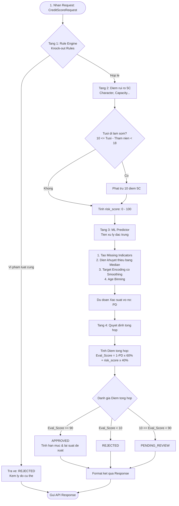

# Quy trình làm sạch dữ liệu và tạo đặc trưng cho AI Service

Tài liệu này mô tả **đúng luồng đang chạy trong repo `ai-service`** để biến dữ liệu LendingClub gốc thành bộ đặc trưng cuối cùng đưa vào mô hình chấm điểm tín dụng.

## 1. Bắt đầu từ dữ liệu gốc

Nguồn gốc dữ liệu là file LendingClub lịch sử với **152 cột**. File này chứa cả:

- cột có thể dùng ngay khi nộp hồ sơ,
- cột chỉ biết sau khi khoản vay đã kết thúc,
- cột là đầu ra của mô hình LendingClub,
- và nhiều cột dư thừa không phù hợp với bối cảnh triển khai thực tế.

Trong repo, bước chuẩn bị đầu tiên được thực hiện trong [scripts/build_dataset.py](../scripts/build_dataset.py).

## 2. Bước 1: đọc đúng các cột cần thiết

Script không đọc toàn bộ 152 cột, mà chỉ đọc nhóm cột cần cho việc lọc và xây dựng dataset chuẩn.

Mục tiêu của bước này là:

- giảm khối lượng đọc dữ liệu,
- chỉ giữ các cột có ý nghĩa cho pipeline,
- chuẩn bị cho các bước lọc tiếp theo.

## 3. Bước 3: lọc dữ liệu đầu vào

Đây là bước quan trọng nhất trong phần làm sạch. Script loại dần các dòng không phù hợp theo thứ tự sau:

### 3.1 Chỉ giữ khoản vay đã kết thúc

Chỉ giữ các khoản có trạng thái:

- `Fully Paid`
- `Charged Off`
- `Default`

Các khoản còn đang chạy hoặc trạng thái khác bị loại.

### 3.2 Loại dòng có thu nhập không hợp lệ

Các dòng có `annual_inc <= 0` bị loại vì không có ý nghĩa nghiệp vụ và làm hỏng các tỷ lệ dẫn xuất.

### 4.4 Loại dòng có DTI sai miền

`dti` được giữ trong miền hợp lệ, các giá trị âm hoặc quá lớn bị loại theo ngưỡng cấu hình.

## 5. Bước 4: tạo cột dẫn xuất dùng cho phân tích

Sau khi lọc, script tạo các cột dẫn xuất phục vụ huấn luyện và kiểm chứng:
- `term_months` = kỳ hạn số

Đây là bước chuyển từ dữ liệu thô sang dữ liệu có ý nghĩa nghiệp vụ hơn.

## 6. Bước 5: xử lý giá trị thiếu

Có 2 kiểu thiếu khác nhau:
- `emp_length = "0 years"`

### 6.2 Thiếu cần thống kê

Các cột cần median thì được giữ `NaN` trong dataset sạch để điền sau khi chia train/test, tránh rò rỉ thống kê.

Nhóm này gồm các cột như:

- `revol_util`
- và một số cột số khác tùy pipeline huấn luyện

## 7. Bước 6: chuẩn hóa và giới hạn ngoại lai

Dữ liệu tiếp tục được chuẩn hóa để phù hợp với môi trường triển khai:

- gộp `NONE` và `ANY` vào `OTHER` cho `home_ownership`
- chuẩn hóa chuỗi `term`
- điều chỉnh `person_age` để không mâu thuẫn với lịch sử tín dụng và thâm niên làm việc
- clip các giá trị ngoại lai.

## 10. Thực nghiệm so sánh và Lý do lựa chọn mô hình XGBoost

Trong giai đoạn đầu của đồ án, chúng tôi đã tiến hành huấn luyện thử nghiệm **4 thuật toán học máy phổ biến** trên cùng một tập dữ liệu kiểm định out-of-time (Huấn luyện các năm trước, Kiểm định trên dữ liệu năm 2015) sử dụng đầy đủ 35 đặc trưng ban đầu (có bao gồm dữ liệu tín dụng CIC/FICO) để chọn ra mô hình tối ưu nhất.

### 10.1 Định nghĩa nghiệp vụ của các chỉ số đánh giá rủi ro tín dụng:

Trước khi đi vào bảng so sánh hiệu năng, dưới đây là định nghĩa kỹ thuật và ý nghĩa nghiệp vụ tài chính của từng chỉ số:

* **Recall (Độ nhạy / Tỷ lệ bắt nợ xấu):**
  * *Ý nghĩa kỹ thuật:* Tỷ lệ dự đoán đúng khách hàng vỡ nợ (nhãn Xấu) trên tổng số khách hàng vỡ nợ thực tế.
  * *Ý nghĩa nghiệp vụ:* Thể hiện khả năng **chặn đứng nợ xấu** của mô hình. Recall càng cao $\rightarrow$ tỷ lệ lọt lưới nợ xấu càng thấp $\rightarrow$ bảo vệ nguồn vốn cho nhà đầu tư khỏi bị mất trắng.
* **Precision (Độ tin cậy cảnh báo rủi ro):**
  * *Ý nghĩa kỹ thuật:* Tỷ lệ khách hàng thực tế vỡ nợ trên tổng số khách hàng mô hình dự báo là vỡ nợ.
  * *Ý nghĩa nghiệp vụ:* Thể hiện việc **tránh từ chối nhầm khách hàng uy tín**. Precision thấp nghĩa là mô hình báo động giả nhiều (coi người tốt là xấu). Precision càng cao $\rightarrow$ tỷ lệ duyệt nhầm khách hàng tốt càng ít $\rightarrow$ bảo vệ doanh thu từ phí dịch vụ và lãi vay cho sàn (giảm thiểu Chi phí cơ hội).
* **F1-Score (Chỉ số cân bằng tổng thể):**
  * *Ý nghĩa kỹ thuật:* Trung bình điều hòa giữa Precision và Recall.
  * *Ý nghĩa nghiệp vụ:* Đánh giá xem mô hình có đạt được sự **cân bằng tối ưu** giữa việc chặn nợ xấu (Recall) và duy trì tăng trưởng doanh số duyệt vay (Precision) hay không.
* **Accuracy (Độ chính xác tổng thể):**
  * *Ý nghĩa kỹ thuật:* Tỷ lệ dự báo đúng (cả Tốt và Xấu) trên tổng số hồ sơ kiểm thử.
  * *Ý nghĩa nghiệp vụ:* Chỉ mang tính chất tham khảo vì dữ liệu tín dụng luôn lệch nhãn nặng (lớp Tốt chiếm đa số). Việc mô hình chỉ đạt Accuracy trung bình nhưng bắt được nợ xấu vẫn có giá trị hơn mô hình Accuracy cao nhờ đoán mò.
* **AUC-ROC (Khả năng phân biệt rủi ro tổng thể):**
  * *Ý nghĩa kỹ thuật:* Diện tích dưới đường cong ROC biểu diễn khả năng phân loại khách hàng tốt/xấu của mô hình ở mọi ngưỡng quyết định.
  * *Ý nghĩa nghiệp vụ:* AUC càng cao chứng tỏ mô hình càng giỏi trong việc sắp xếp người có rủi ro cao vào nhóm điểm thấp và người uy tín vào nhóm điểm cao. Trong tài chính, AUC > 0.6 là khả thi, > 0.7 là rất tốt.
* **Gini Index (Hệ số phân tách Gini):**
  * *Ý nghĩa kỹ thuật:* Được liên hệ trực tiếp với AUC qua công thức: $Gini = 2 \times AUC - 1$.
  * *Ý nghĩa nghiệp vụ:* Chỉ số tiêu chuẩn thường dùng trong các báo cáo thẻ điểm tín dụng (Credit Scorecard) tại ngân hàng. Gini càng cao thể hiện khả năng xếp hạng rủi ro của khách hàng càng rõ rệt.
* **KS Statistic (Chỉ số Kolmogorov-Smirnov):**
  * *Ý nghĩa kỹ thuật:* Khoảng cách lớn nhất giữa hai đường phân phối tích lũy của nhóm khách hàng Tốt và Xấu.
  * *Ý nghĩa nghiệp vụ:* Thể hiện khả năng phân tách dứt khoát hai nhóm tốt/xấu của mô hình. KS càng lớn $\rightarrow$ điểm cắt phê duyệt (Cut-off) càng hiệu quả và dứt khoát. KS > 20% là khả thi, > 30% là rất xuất sắc.

### 10.2 Kết quả thực nghiệm so sánh các mô hình

Kết quả đo lường hiệu năng của 4 mô hình được thể hiện ở bảng dưới đây:

| Thuật toán | AUC-ROC | Gini Index | KS Statistic | Recall | Precision | F1-Score | Accuracy |
| :--- | :---: | :---: | :---: | :---: | :---: | :---: | :---: |
| **Logistic Regression (LR)** | 0.5677 | 0.1354 | 0.1026 | 45.03% | 18.01% | 0.2573 | 61.30% |
| **Random Forest (RF)** | 0.6546 | 0.3093 | 0.2250 | 61.02% | 21.57% | 0.3187 | 61.16% |
| **AdaBoost (ADA)** | 0.6402 | 0.2803 | 0.2033 | **68.98%** | 19.83% | 0.3081 | 53.88% |
| **XGBoost (XGB) - Lựa chọn** | **0.6730** | **0.3459** | **0.2503** | 64.13% | **22.23%** | **0.3302** | **61.26%** |

### Phân tích và Lý do lựa chọn mô hình từ góc độ Nghiệp vụ Tài chính:

Trong chấm điểm tín dụng tài chính, việc lựa chọn mô hình không chỉ dựa vào chỉ số kỹ thuật thuần túy mà là bài toán **cân bằng giữa Kiểm soát rủi ro nợ xấu và Tăng trưởng doanh thu (Risk-Return Trade-off)**:

1. **Khả năng phân loại nợ xấu tối ưu (Tối thiểu hóa tổn thất tín dụng):**
   * XGBoost đạt chỉ số **Gini = 0.3459** và **KS Statistic = 0.2503** vượt trội. Trong nghiệp vụ ngân hàng, chỉ số KS đo lường khoảng cách phân tách lớn nhất giữa phân phối của nhóm khách hàng tốt và khách hàng xấu. Chỉ số KS cao chứng tỏ XGBoost giúp sàn P2P tự tin thiết lập các chính sách phê duyệt cắt bỏ nợ xấu chính xác hơn, bảo vệ nguồn vốn của nhà đầu tư.
2. **Giải quyết bài toán Chi phí cơ hội (Opportunity Cost) và Doanh thu:**
   * **AdaBoost** đạt Recall cao nhất (68.98%) nhưng lại có Precision cực thấp (19.83%). Dưới góc độ nghiệp vụ, Precision thấp đồng nghĩa với việc mô hình bị lỗi **Phê duyệt sai (False Alarm)** quá cao — từ chối nhầm một lượng lớn khách hàng thực sự uy tín. Việc này tạo ra **chi phí cơ hội khổng lồ** do sàn bị mất đi doanh thu từ phí dịch vụ và lãi vay của khách hàng tốt.
   * **Logistic Regression** có AUC-ROC quá thấp (0.5677), gần như tiệm cận đoán mò, không thể ứng dụng vì sẽ duyệt nhầm quá nhiều nợ xấu.
   * **XGBoost** mang lại **điểm cân bằng hoàn hảo nhất** khi đạt **F1-Score cao nhất (0.3302)**. Mô hình vừa giữ được tỷ lệ bắt nợ xấu rất tốt (Recall 64.13%) vừa giảm thiểu tối đa tỷ lệ từ chối nhầm khách hàng tốt nhờ Precision cao nhất (22.23%). Điều này giúp sàn P2P tối ưu hóa cả hai mục tiêu: Kiểm soát nợ xấu trong ngưỡng an toàn và Tối đa hóa doanh thu giải ngân.

### Sự phù hợp của Loại dữ liệu huấn luyện (Data Suitability):

1. **Ứng dụng Dữ liệu phi truyền thống (Alternative Data) cho đối tượng Underbanked:**
   * Khách hàng tìm đến các nền tảng cho vay ngang hàng (P2P Lending) phần lớn là nhóm khách hàng dưới chuẩn ngân hàng (Subprime) hoặc nhóm khách hàng chưa có lịch sử tín dụng tại các tổ chức tài chính lớn (Unbanked/Underbanked). Họ hoàn toàn không có điểm CIC truyền thống.
   * Việc thiết kế mô hình sử dụng **Alternative Data** (như nhân thân qua eKYC, thâm niên công việc tự khai, tỷ lệ nợ DTI tự khai) là hoàn toàn phù hợp với thực tế tệp khách hàng của FINORA. Việc mô hình v10.0.0 (không dùng CIC) vẫn đạt AUC-ROC thực tế **0.6531** chứng minh tính khả thi cao của phương án này.
2. **Học từ hành vi khuyết thiếu thông tin (Missing Data Behavior):**
   * Trong đăng ký vay online, khách hàng thường cố ý bỏ trống hoặc che giấu các thông tin tài chính bất lợi.
   * Việc kết hợp cơ chế xử lý khuyết thiếu tự động của XGBoost với việc tạo các cột **Missing Indicators (`_missing`)** giúp mô hình học được mối tương quan giữa hành vi cố ý không khai báo thông tin với rủi ro vỡ nợ thực tế (một dạng Fraud Detection rất phổ biến trong tài chính).

Do đó, **XGBoost** kết hợp với bộ dữ liệu phi truyền thống là phương án tối ưu nhất cho hoạt động kinh doanh của FINORA.

## 11. Bước huấn luyện model v10.0.0 (Cập nhật mới)

Giai đoạn huấn luyện hiện tại được thực hiện trong [scripts/train_credit_model.py](../scripts/train_credit_model.py).

Quy trình làm sạch và chuẩn bị dữ liệu trong RAM được cải tiến như sau:

1. **Đọc dữ liệu** từ `data/lc_clean.csv`.
2. **Lọc thời gian phát hành:** Chỉ giữ lại dữ liệu của hai năm **2012** và **2014** (giảm từ 673.540 dòng xuống còn 215.937 dòng) để tối ưu thời gian huấn luyện và giữ chất lượng phân phối tốt nhất cho tập kiểm thử out-of-time (OOT) `2012 -> 2014`.
3. **Chuẩn hóa tiền tệ động theo năm (Dynamic Present Value Scaling):** 
   Thay vì nhân với một hệ số cố định, hệ thống áp dụng hệ số quy đổi động cho từng dòng dựa trên năm phát hành $Y$:
   $$k_Y = \frac{\text{Thu nhập bình quân Việt Nam}}{\text{Thu nhập bình quân Mỹ năm } Y}$$
   Hệ số $k_Y$ được nhân trực tiếp cho 3 cột tiền tệ: `annual_inc` (thu nhập năm), `loan_amnt` (khoản vay), và `installment` (số tiền trả nợ hàng tháng) để đưa dữ liệu lịch sử về cùng một mặt bằng sức mua đồng nhất tại Việt Nam.
4. **Tạo chỉ báo khuyết thiếu (Missing Indicators):** Tạo cột `_missing` cho tất cả các biến số học có khả năng khuyết thiếu trước khi điền giá trị trung vị (median).
5. **Điền giá trị khuyết thiếu:** Điền trung vị (median) của tập huấn luyện cho các giá trị `NaN` ở các biến số học.
6. **Mã hóa Target Encoding với Smoothing:** Thay thế One-Hot thô bằng Target Encoding có làm mịn (smoothing factor $m=10.0$) cho 3 biến phân loại (`home_ownership`, `purpose`, `verification_status`) giúp XGBoost tránh overfitting và giảm số chiều đặc trưng từ 41 xuống còn 26 đặc trưng.
7. **Age Binning:** Phân nhóm độ tuổi thành các bins (`age_under_25`, v.v.).
8. **Đánh giá Out-of-time (OOT):** Huấn luyện trên năm 2012, kiểm thử trên năm 2014.
9. **Huấn luyện mô hình cuối cùng:** Huấn luyện lại trên 100% dữ liệu đã lọc (215.937 dòng) bằng thuật toán XGBoost và lưu đĩa.

## 12. Danh sách và Ý nghĩa của 15 Đặc trưng đầu vào thô (Input Features)

Dưới đây là danh sách và ý nghĩa của **15 đặc trưng đầu vào thô** của hệ thống (phù hợp với cấu trúc dữ liệu của file [data_real.csv](file:///c:/Users/PC/Desktop/Data/Đồ%20Án/finora-platform/finora-ai/data/data_real.csv) và API Request), được phân loại theo các vùng nghiệp vụ tài chính cụ thể:

### A. Vùng Nhân thân & Việc làm (Personal & Employment Profile)
1. **`person_age` (Tuổi khách hàng):** Tuổi thực tế của người đi vay (lấy từ dữ liệu CCCD qua eKYC). Dùng để đánh giá độ chín chắn hành vi tài chính và phân nhóm độ tuổi.
2. **`emp_length` (Thâm niên làm việc):** Số năm làm việc liên tục tại cơ quan hiện tại (nhận dạng qua chuỗi tự khai hoặc sao kê hợp đồng). Thâm niên càng dài thể hiện công việc và dòng thu nhập càng ổn định.
3. **`home_ownership` (Tình trạng nhà ở):** Trạng thái sở hữu nhà của khách hàng (`RENT`, `OWN`, `MORTGAGE`, `OTHER`). Thể hiện đệm tài sản đảm bảo của người vay.

### B. Vùng Hồ sơ Tài chính (Financial Profile)
4. **`annual_inc` (Thu nhập năm):** Tổng thu nhập trong 1 năm của khách hàng (sau khi được quy đổi và chuẩn hóa sang VNĐ). Đây là chỉ số quan trọng đo lường năng lực trả nợ tổng thể.
5. **`dti` (Tỷ lệ nợ trên thu nhập - Debt-to-Income):** Tỷ lệ tổng các khoản nợ phải trả hàng tháng chia cho thu nhập hàng tháng (%). Chỉ số này càng cao nghĩa là áp lực nợ hiện tại của khách hàng càng lớn.

### C. Vùng Thông tin Khoản vay yêu cầu (Loan Details)
6. **`loan_amnt` (Số tiền vay yêu cầu):** Khoản tiền khách hàng muốn đăng ký vay trên sàn FINORA (đơn vị VNĐ).
7. **`purpose` (Mục đích vay):** Lý do sử dụng vốn vay (ví dụ: trả nợ thẻ, mua xe, sửa nhà, y tế...). Từng mục đích vay sẽ được mô hình tự động mã hóa để tính toán xác suất rủi ro tương ứng.
8. **`term_months` (Kỳ hạn vay):** Thời gian vay yêu cầu tính bằng tháng (ví dụ: 12 tháng, 24 tháng).
9. **`int_rate` (Lãi suất đề xuất):** Lãi suất áp dụng cho gói vay (%/năm), được hệ thống hoặc nhà đầu tư đề xuất.
10. **`installment` (Số tiền trả nợ hàng tháng):** Số tiền gốc và lãi phải thanh toán định kỳ mỗi tháng (VNĐ).

### D. Vùng Lịch sử tín dụng & Chỉ số rủi ro (Credit History & Risk Indicators)
11. **`fico_score` (Điểm tín dụng):** Điểm tín dụng quy đổi từ thang FICO/CIC (300-850). Điểm số này càng cao thể hiện độ uy tín tín dụng trong quá khứ càng tốt.
12. **`delinq_2yrs` (Số lần trễ hạn 2 năm):** Số lần khách hàng thanh toán trễ hạn quá 30 ngày đối với các khoản nợ khác trong vòng 2 năm qua.
13. **`pub_rec` (Hồ sơ xấu công khai):** Số lượng hồ sơ pháp lý công khai bất lợi (như phá sản, tranh chấp tài sản...).
14. **`verification_status` (Trạng thái xác thực thu nhập):** Thể hiện thu nhập của khách hàng đã được đối chiếu, xác thực qua hồ sơ chứng minh chưa (`Verified`, `Source Verified`, `Not Verified`).
15. **`loan_status` (Nhãn trạng thái khoản vay):** Nhãn mục tiêu trong dữ liệu huấn luyện (`0` - Trả nợ tốt đầy đủ, `1` - Vỡ nợ quá hạn). Nhãn này chỉ dùng khi huấn luyện mô hình để máy học được hành vi phân loại, không truyền lên khi API gọi thật.

## 13. Bộ đặc trưng cuối cùng đưa vào mô hình (28 đặc trưng)

Phần tạo đặc trưng nằm trong [app/ml/credit/features.py](../app/ml/credit/features.py). Bộ đặc trưng bao gồm:

* **13 đặc trưng số học thô:** `person_age`, `emp_length_years`, `annual_inc`, `loan_amnt`, `dti`, `term_months`, `delinq_2yrs`, `pub_rec`, `int_rate`, `installment`, `fico_score`, `log_income`, `loan_to_income`.
* **3 đặc trưng mã hóa Target Encoding:** `home_ownership_encoded`, `purpose_cat_encoded`, `verification_status_encoded`.
* **8 chỉ báo thiếu:** `person_age_missing`, `emp_length_years_missing`, `dti_missing`, `delinq_2yrs_missing`, `pub_rec_missing`, `int_rate_missing`, `installment_missing`, `fico_score_missing`.
* **4 đặc trưng phân nhóm tuổi:** `age_under_25`, `age_25_to_39`, `age_40_to_59`, `age_over_60`.

Tổng cộng mô hình học máy sử dụng **28 đặc trưng**.

## 14. Bộ quy tắc chốt chặn cứng & Phạt điểm rủi ro (Rule Engine)

Hệ thống ra quyết định tín dụng được thiết kế dạng lai (Hybrid System) tích hợp chốt chặn cứng tại [app/services/credit/rule_engine.py](../app/services/credit/rule_engine.py):

### 14.1 Các quy tắc chặn cứng (Knock-out Rules - REJECTED)
* **Trần lãi suất pháp luật:** Lãi suất năm `int_rate` vượt quá 20% (Bộ luật Dân sự 2015).
* **Trần kỳ hạn vay:** Kỳ hạn `term_months` vượt quá 24 tháng (Nghị định 94/2025/NĐ-CP cho P2P).
* **Áp lực trả nợ quá lớn:** Số tiền trả nợ hàng tháng chiếm trên 50% thu nhập hàng tháng (`installment / (annual_inc / 12) > 0.50`).
* **Gian lận tuổi tác / Bất hợp lý dữ liệu nặng:** Tuổi và thâm niên việc làm phi lý, tương đương đi làm trước 10 tuổi (`tuoi - tham_nien < 10`).

### 14.2 Quy tắc phạt điểm rủi ro (Risk Scoring Penalty)
* **Tuổi đi làm sớm bất hợp lý nhẹ:** Nếu thâm niên làm việc tính ra bắt đầu từ khi chưa đủ 18 tuổi nhưng từ 10 tuổi trở lên (`10 <= tuoi - tham_nien < 18`), hệ thống sẽ **trừ thẳng 10 điểm phạt** vào tổng điểm rủi ro 5C (Character) thay vì từ chối thẳng.

## 15. Tóm tắt ngắn gọn quy trình

1. **Dữ liệu thô 152 cột** $\rightarrow$ Lọc thành dataset sạch 32 cột (`lc_clean.csv`).
2. **Lọc vintage thời gian:** Chỉ giữ năm 2012 và 2014.
3. **Chuẩn hóa VND động** theo năm cho các trường tiền tệ sau đó chuyển về VND vào năm 2025.
4. **Tạo Missing Indicators & Bins tuổi**.
5. **Áp dụng Target Encoding có Smoothing** cho biến phân loại.
6. **Chấm điểm rủi ro 5C** kết hợp luật chặn cứng & phạt điểm.
7. **Dự báo xác suất vỡ nợ (PD)** qua XGBoost (28 đặc trưng).
8. **Quyết định tự động:** `APPROVED` / `PENDING_REVIEW` / `REJECTED`.

## 16. So do luong quyet dinh khi mot ho so duoc gui (Decision Flow)

Duoi day la so do Mermaid bieu dien chi tiet cac buoc xu ly khi he thong nhan duoc mot ho so vay (CreditScoreRequest):

## 17. File lien quan

- [app/ml/credit/features.py](../app/ml/credit/features.py)
- [app/ml/credit/preprocessing.py](../app/ml/credit/preprocessing.py)
- [app/ml/credit/predictor.py](../app/ml/credit/predictor.py)
- [app/services/credit/rule_engine.py](../app/services/credit/rule_engine.py)
- [scripts/train_credit_model.py](../scripts/train_credit_model.py)
- [app/schemas/credit.py](../app/schemas/credit.py)
